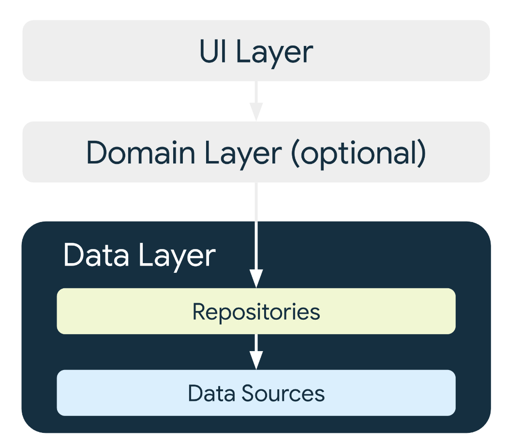

<h1 align="center">Android Architecture Sample App made by SangYoon Song</h1>

<p align="center">  


🌻 This app follow [Google's official architecture guidance](https://developer.android.com/topic/architecture) and made with [Marvle open API](https://developer.marvel.com/). Let's take a look at the sample app specifically. Additionally, the DataLayer of this app is implemented with multiple source which means for '**paging source**', '**room database**', '**work manager**'  

</p>

## 🏛️ Architecture


This app architecture consist of **UI Layer**, **Domain Layer**, **Data Layer**. and let's explain the responsibility of each layers in order

### UI layer


UI layer consist of '**UI Element**', '**Data Holder Class**' (can be think as AAC ViewModel) 

👉 **UI element** is pure UI logic, correspond to '**View-System UI**' or '**Compose UI**' logic including 'Button', 'TextField', 'BottomNavigation' etc... 

To put it in context with the architecture above, '**MainActivity**', '**HomeScreen**', '**BookmarkScreen**' correspond to this.

👉 **Data Holder Class** is defined in the AAC ViewModel (meaning for 'Jetpack library') and is a class that represents the state of the UI.

To put it in context with architecture above, '**HomeViewModel**', '**BookmarkViewModel**' correspond to this. and also define '**CharacterUiModel**' wrapping '**UiResult**' which has three state of '**Loading**', '**Success**', '**Error**' 


### Domain layer

Domain Layer has two responsibility. 

👉 Responsibility for defining the duplicate logic in AAC ViewModel.

👉 Responsibility for defining the complex business logic in AAC ViewModel.

To put it in context with architecture above, The domain layer of this sample app implements the responsibility of defining the duplicate logic. that is '**ModifyCharacterSavedStatusUseCase**'

### Data layer


Data Layer has '**Repository Module**' which is first entry point of '**UI Layer**' and '**Domain Layer**'. '**Repository Moddule**' has three responsibilities 

👉 Responsibility for querying local data from database or file system or AndroidKeyStore

👉 Responsibility for requesting remote data from network

👉 Responsible for coordinating data from remote or local data sources

To put it in context with architecture above, The repository module within Data Layer is 'CharacterRepository'

## 🤝 Contribution
My sample app is not perfect and has many shortcomings. Therefore, I would be very happy if you could request a pull request for the development of the app. Always welcome.

# License
```xml
Designed and developed by 2024 squart300kg (sangyoon song)

Licensed under the Apache License, Version 2.0 (the "License");
you may not use this file except in compliance with the License.
You may obtain a copy of the License at

   http://www.apache.org/licenses/LICENSE-2.0

Unless required by applicable law or agreed to in writing, software
distributed under the License is distributed on an "AS IS" BASIS,
WITHOUT WARRANTIES OR CONDITIONS OF ANY KIND, either express or implied.
See the License for the specific language governing permissions and
limitations under the License.